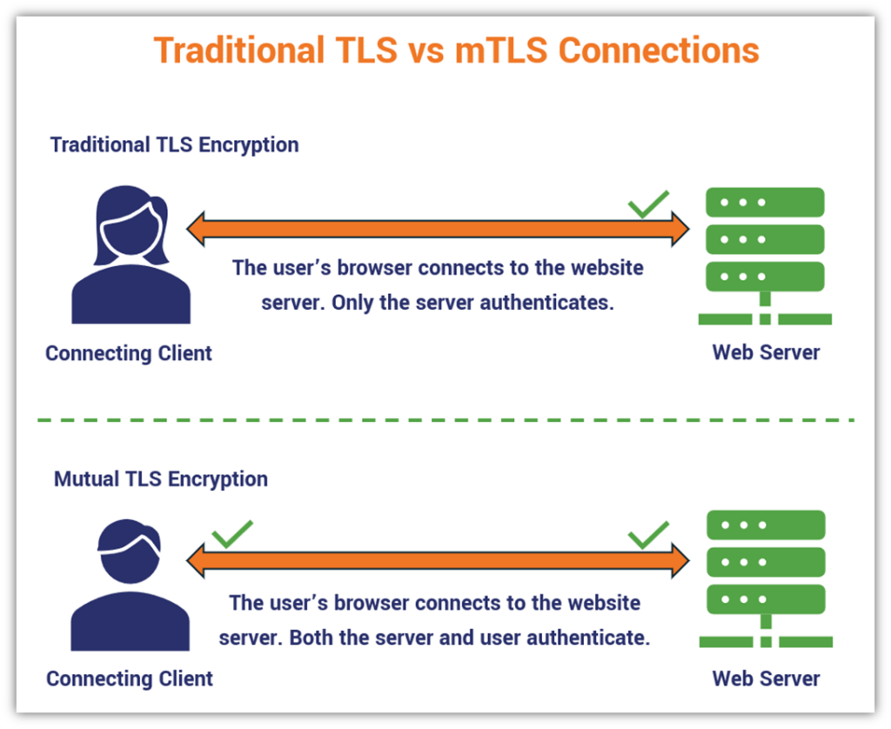

# istio multi cluster Architecture

### Goal : 
Pod , Object 들은 모두 mTLS 통신을 진행하고, A cluster에서 장애가 발생 시 B Cluster에서 대신 처리를 해야 합니다. 

## Architecture 

### Federation  ?? 
Federation : 네트워크를 연결하고 리소스를 공유하는 것을 의미 합니다. 
East-West Federation : 클러스터간 직접 연결을 통해 리소스 공유하는 방식입니다. 
North-South Federation : 클러스터 외부를 경유해 리소스를 공유하는 방식입니다. 

### mTLS ?? 
mTLS vs TLS : TLS 인증 방식은 Web Server에 인증서만 있어도 TLS를 통신을 할 수 있습니다. 하지만, mTLS는 Client와 Web Server 모두 인증서를 가지고 있어야 TLS로 통신을 할 수 있습니다. 아래 이미지를 참고 하세요. 

